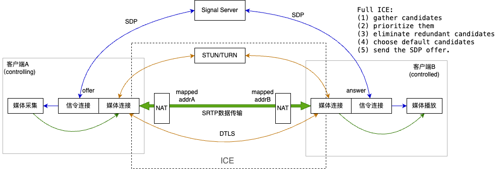

 WebRTC（Web Real-Time Communication）是一套支持通过Web浏览器进行实时音视频通话的API和协议。WebRTC前身为GIPS引擎，被Google在2010年5月收购后改名为WebRTC，于2011年6月开源，2012年后，多家主流浏览器chrome、mozilla、opera等提供对WebRTC的支持。

 ## WebRTC的P2P通信
WebRTC规范主要由两块组成，而每块又由多个其他规范构成。
1. API规范，定义一系列的JavaScript API，由W3C标准组织维护。具体见[WebRTC API](https://www.w3.org/TR/webrtc/)
2. 协议规范，定义音视频通话的交互过程，由IETF组织维护。协议规范不要求通信的对方一定是浏览器，只要实现这个规范的应用或设备都可以相互通信。具体见[RFC8825](https://datatracker.ietf.org/doc/html/rfc8825)

实现应用层音视频P2P的互相通信，需要交换以下信息：
1. 媒体协商。交换通信两端媒体信息，以便双方都可以正常进行编解码
2. 网络协商。交换两端网络信息，选择可通信的最优网络，且让对方清楚本次通话的网络协议、IP、端口。
3. 密钥协商。认证身份后，交换通信密钥，为防止音视频明文数据在网络上流动被人抓包截获，需要传输时进行加密。

一个典型的WebRTC通信系统组成如下：



以上系统实现了端到端的通信，但是当有第三个客户端C或更多客户端加入会话时，存在以下问题：
1. C需要同时与A、B协商媒体、网络、密钥建立连接。不同客户端支持的编解码兼容性有差异，不同客户端NAT网络防火墙约束也可能不同，P2P通话容易失败。
2. 即使通话连接成功，每个端需要收发会话中所有其他用户的流量，消耗的带宽使一般客户端无法承受。
3. 其中一个端网络断掉重连后，需要与所有用户进行重新协商，这个不稳定的网络端会导致整个系统反复协商
4. 无法进行集中的延迟监控和带宽控制管理、视频录制等

因此以上系统几乎不会在音视频通话的生产环境上使用。

主流的WebRTC通信系统，会增加媒体服务器作为参与方，每个端都通过媒体服务器进行通信，在服务端可以做合流等各种管控。但由于WebRTC协议缺少对信令协议的规范，不同的WebRTC通信端信令可能各不相同，这就可能会导致不同的WebRTC产品或服务间通信存在兼容性问题。这时WHIP和WHEP就挺身而出了。

## WHIP和WHEP

RFC规范中描述的消息流如下：

**WHIP流程图**
```

 +-------------+    +---------------+ +--------------+ +---------------+
 | WHIP client |    | WHIP endpoint | | Media Server | | WHIP session  |
 +--+----------+    +---------+-----+ +------+-------+ +--------|------+
    |                         |              |                  |
    |                         |              |                  |
    |HTTP POST (SDP Offer)    |              |                  |
    +------------------------>+              |                  |
    |201 Created (SDP answer) |              |                  |
    +<------------------------+              |                  |
    |          ICE REQUEST                   |                  |
    +--------------------------------------->+                  |
    |          ICE RESPONSE                  |                  |
    |<---------------------------------------+                  |
    |          DTLS SETUP                    |                  |
    |<======================================>|                  |
    |          RTP/RTCP FLOW                 |                  |
    +<-------------------------------------->+                  |
    | HTTP DELETE                                               |
    +---------------------------------------------------------->+
    | 200 OK                                                    |
    <-----------------------------------------------------------x

        Figure 1: WHIP session setup and teardown  
```

**WHEP流程图**
``` 
+-------------+    +---------------+ +--------------+ +---------------+
 | WHEP player |    | WHEP endpoint | | Media Server | | WHEP session |
 +--+----------+    +---------+-----+ +------+-------+ +--------|------+
    |                         |              |                  |
    |                         |              |                  |
    |HTTP POST (SDP Offer)    |              |                  |
    +------------------------>+              |                  |
    |201 Created (SDP answer) |              |                  |
    +<------------------------+              |                  |
    |          ICE REQUEST                   |                  |
    +--------------------------------------->+                  |
    |          ICE RESPONSE                  |                  |
    |<---------------------------------------+                  |
    |          DTLS SETUP                    |                  |
    |<======================================>|                  |
    |          RTP/RTCP FLOW                 |                  |
    +<-------------------------------------->+                  |
    | HTTP DELETE                                               |
    +---------------------------------------------------------->+
    | 200 OK                                                    |
    <-----------------------------------------------------------x

              Figure 1: WHEP session setup and teardown
```

从以上可以看出，WHIP和WHEP通信过程是非常相似的。他们都明确定义了以下内容：
1. 通信阶段：SDP，ICE，DTLS，RTP/RTCP，会话销毁
2. SDP的协商采用HTTP接口，POST方法
3. 引入了Media Server作为WebRTC通信的对端
4. WHIP的流是单向的，从push(Publish)端流向Media Server
5. WHEP的流是单向的，从Media Server流向player(Subscribe)端


结合WebRTC通信过程分析，一个简单的WHIP、WHEP系统可以用下图表示：


 ## 协议规范
| 协议       | 链接                                                       | 备注                           |
| ---------- | ---------------------------------------------------------- | ------------------------------ |
| WHIP       | https://datatracker.ietf.org/doc/html/draft-ietf-wish-whip |                                |
| WHEP       | https://datatracker.ietf.org/doc/draft-ietf-wish-whep/     |                                |
| WebRTC     | https://datatracker.ietf.org/doc/html/rfc8825              |                                |
| WebRTC API | https://www.w3.org/TR/webrtc/                              |                                |
| ICE        | https://www.rfc-editor.org/rfc/rfc5245                     |                                |
| JSEP       | https://datatracker.ietf.org/doc/html/rfc8829              | webrtc浏览器必须实现的接口协议 |
| SDP        | https://datatracker.ietf.org/doc/html/rfc3264              |                                |
| DTLS       | https://datatracker.ietf.org/doc/html/rfc6347              |                                |
| RTP        | https://datatracker.ietf.org/doc/html/rfc3550              |                                |
| SRTP       | https://datatracker.ietf.org/doc/html/rfc3711              |                                |
|            |                                                            |                                |
